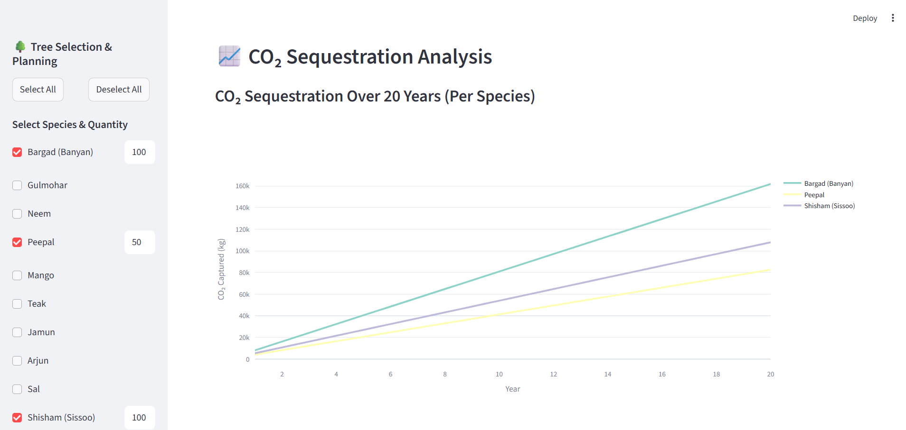
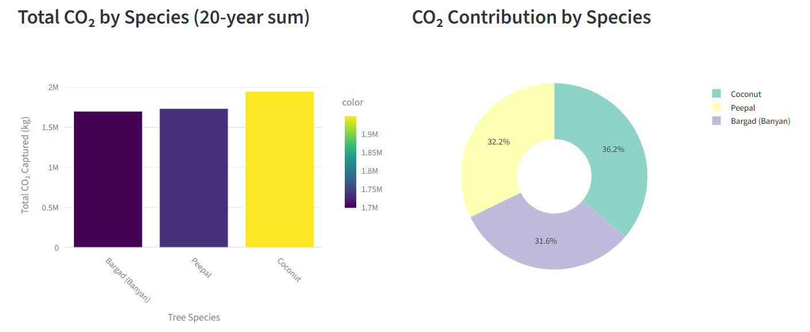
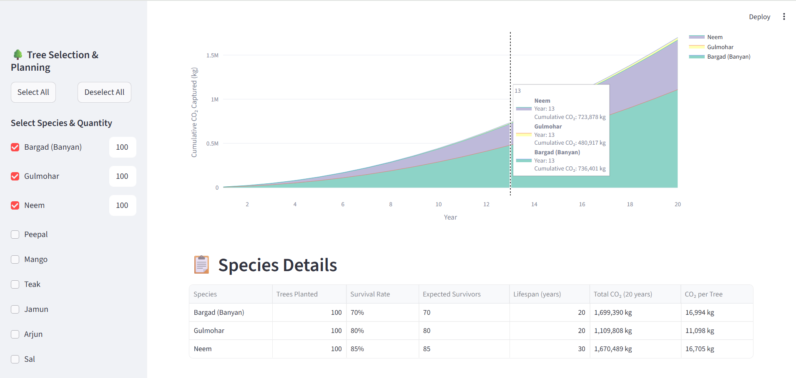
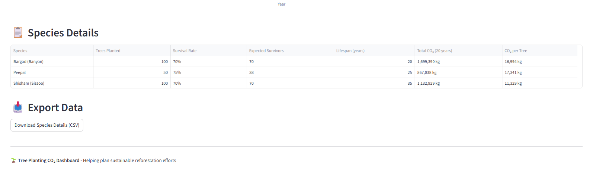

# 🌱 Afforestation Impact Modeling


**Category:** Carbon Footprint Reduction  
**Project Type:** Interactive Dashboard / Environmental Analysis

---

## **Project Overview**

Afforestation Impact Modeling is an interactive Streamlit-based dashboard that helps visualize and quantify the carbon sequestration potential of various tree species over a 20-year period. This project aims to guide planners, environmentalists, and local governments in sustainable reforestation efforts by estimating CO₂ capture based on tree species, growth patterns, and survival rates.

The tool leverages **realistic tree growth data** and allows users to simulate different planting scenarios for optimal carbon footprint reduction.

---

## **Key Features**

* 🌳 **Tree Species Selection:** Choose from 34 tree species for modeling.
* 🌱 **Dynamic Quantity Input:** Set the number of trees for each selected species.
* 📊 **Interactive Charts:**
  * Line chart for CO₂ sequestration over 20 years per species.
  * Bar chart for total CO₂ captured by species.
  * Donut chart showing contribution percentages.
  * Cumulative CO₂ area chart over time.
* ♻️ **Metric Calculations:**
  * Total trees planted
  * Expected survivors
  * Total CO₂ captured (20 years)
  * Average CO₂ per tree
* 📋 **Detailed Data Table:** Shows per-species statistics including lifespan, survival rate, expected survivors, and CO₂ captured.
* 📥 **Export Option:** Download species analysis as CSV.

---

## **Dataset**

The dataset is located in the `dataset/tree-species.json` file and includes **34 tree species**. Each species contains:

* Average biomass per year
* Carbon content ratio
* CO₂ conversion factor
* Survival rate
* Lifespan (years)
* CO₂ sequestration per year over 20 years

---

## **Installation**

### **1. Clone the repository**

```bash
git clone https://github.com/tejasviravikumar/Afforestation-Impact-Modeling.git
cd Afforestation-Impact-Modeling
```

### **2. Create and activate a virtual environment** (optional but recommended)

```bash
python -m venv venv

# Windows
venv\Scripts\activate

# Mac/Linux
source venv/bin/activate
```

### **3. Install dependencies**

```bash
pip install -r requirements.txt
```

---

## **Requirements**

Create a `requirements.txt` file in the project root with the following content:

```text
streamlit>=1.22.0
pandas>=2.1.1
numpy>=1.26.0
plotly>=5.18.0
```

This ensures all necessary libraries for running the app are installed.

---

## **Usage**

Run the Streamlit app:

```bash
streamlit run app.py
```

* Use the **sidebar** to select tree species and input the number of trees.
* View **metrics**, **interactive charts**, and **cumulative CO₂ projections**.
* Download the CSV of your simulation results for further analysis.

---

## **Impact Modeling Workflow**

1. **Data Collection:** Tree growth curves and carbon fixation rates.
2. **Model Development:** Scripts project biomass and carbon accumulation over time.
3. **Scenario Analysis:** Simulate different planting scales and species mixes.
4. **Results Presentation:** Interactive visualization of CO₂ uptake and species contribution.
5. **Policy Brief:** Summarize outcomes for planners and institutional land-use teams.

**Impact Metric:** Estimated metric tons of CO₂ sequestered over a 10–20 year timeline per 100 trees planted (by species).

---

## **Screenshots**
### First Page


### Graph 1


### Donut Chart


### Graph 2


### CSV Export



---

## **Project Structure**

```
Afforestation-Impact-Modeling/
│
├── app.py                      # Main Streamlit application
├── dataset/
│   └── tree-species.json       # Tree species data with carbon metrics
├── requirements.txt            # Python dependencies
├── README.md                   # Project documentation
└── .gitignore                  # Git ignore file
```

---

## **Contributing**

Contributions are welcome! Here's how you can help:

1. Fork the repository
2. Create a feature branch (`git checkout -b feature/AmazingFeature`)
3. Commit your changes (`git commit -m 'Add some AmazingFeature'`)
4. Push to the branch (`git push origin feature/AmazingFeature`)
5. Open a Pull Request

---

## **License**

This project is licensed under the MIT License - see the [LICENSE](LICENSE) file for details.

---

## **Contact**

**Tejasvi Ravikumar**  
GitHub: [@tejasviravikumar](https://github.com/tejasviravikumar)

---

## **Acknowledgments**

* Tree species data compiled from forestry research and environmental studies
* Built with [Streamlit](https://streamlit.io/)
* Visualization powered by [Plotly](https://plotly.com/)

---

⭐ **If you find this project helpful, please consider giving it a star!**
